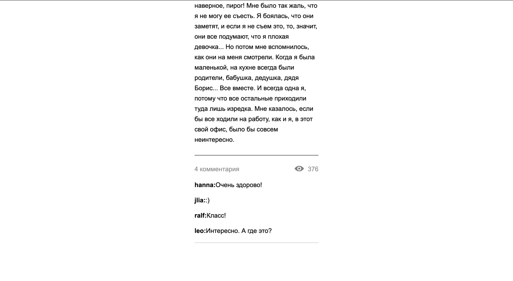
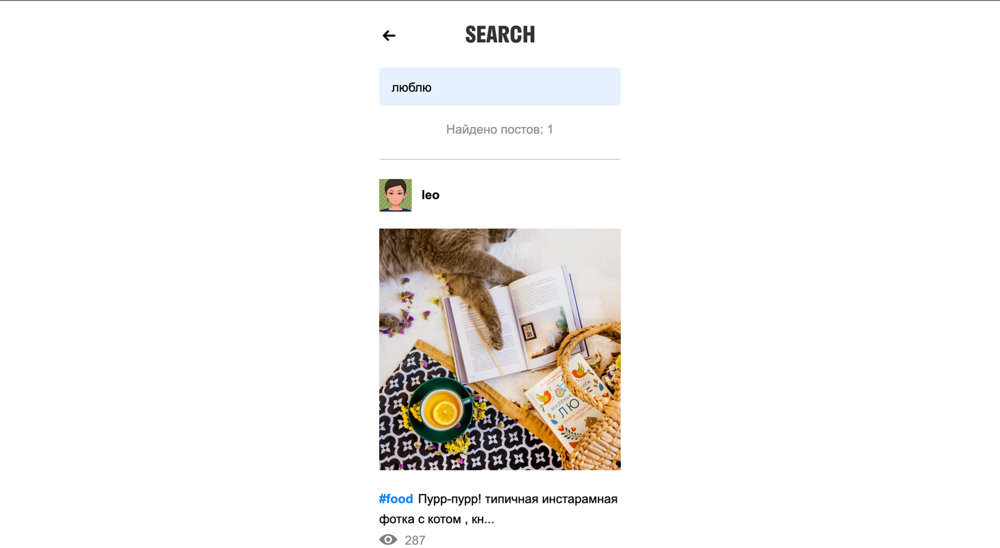

Skyprogram
=
Skyprogram - соцсеть, функционал которой был взят с Instagram, для тренировки навыков Python + flask, HTML, Jinja
Ссылка на сайт проекта: http://d3niss.online/
***
Описание проекта:
=
Основная страница
-

У пользователя есть возможность посмотреть посты всех пользователей с

* информацией о количестве просмотров
* картинкой
* подписью
* именем автора поста

***
Подробная страница поста
-

У пользователя есть возможность

* подробно прочитать текст к посту
* прочитать комментарии к посту
* посмотреть информации о количестве просмотров

***
Страница поиска
-

У пользователя есть возможность выполнить поиск по

* букве или символу
* слову
* предложению

***
Страница профиля пользователя
-

Нажав на аватар любого автора поста у пользователя есть возможность

* посмотреть количество просмотров на каждом посте
* увидеть сокращенный текст каждого поста
* увидеть картинку каждого поста

***

**Для того что бы запустить программу необходимо:**

1. установить все из файла "requirements.txt"
2. запустить файл "app.py"
